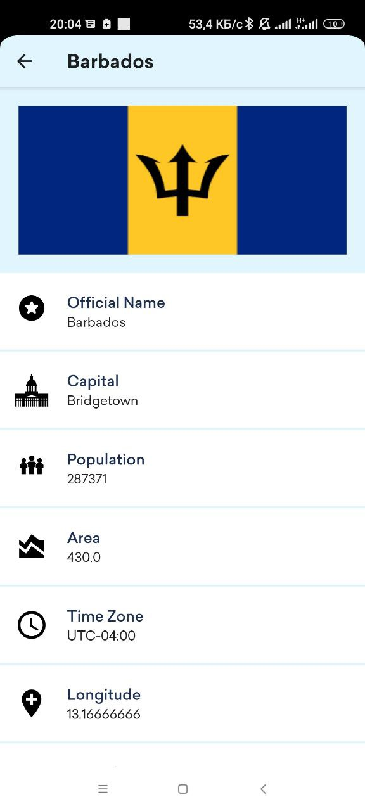

# Country Of World, a simple app with interactive desing and UI.
Compose-Country Of World is a sample project that presents a way of implementing UI components with Jetpack Compose.

## About this project 💡
Country Of World Android app is available with _traditional approach using Navigation Architecture_ as well as modern UI development toolkit i.e. _Jetpack Compose UI_.

## Screenshots
  ### Light Mode
  
  

  
  
 
  

  
  ### Dark Mode
  
 

  
  
 
  

## CountryApi

App uses [CountryAPI](https://restcountries.com/) for fetching data 

## Built with 🛠
- [Kotlin](https://kotlinlang.org/) - First class and official programming language for Android development.
- [ViewModel](https://developer.android.com/topic/libraries/architecture/viewmodel) - Stores UI-related data that isn't destroyed on UI changes.
- [Jetpack Compose UI Toolkit](https://developer.android.com/jetpack/compose) - Modern UI development toolkit.
- [Accompanist](https://google.github.io/accompanist/) - Accompanist is a group of libraries that aim to supplement Jetpack Compose with features that are commonly required by developers but not yet available.
- [Coroutines](https://kotlinlang.org/docs/reference/coroutines-overview.html) - Provide sophisticated tools to handle concurrency.
- [Dependency Injection](https://developer.android.com/training/dependency-injection) -
  - [Hilt-Dagger](https://dagger.dev/hilt/) - Standard library to incorporate Dagger dependency injection into an Android application.
  - [Hilt-ViewModel](https://developer.android.com/training/dependency-injection/hilt-jetpack) - DI for injecting `ViewModel`.

## Author
- [@BahromzodaBehruz](https://github.com/bahromzodabehruz27)

